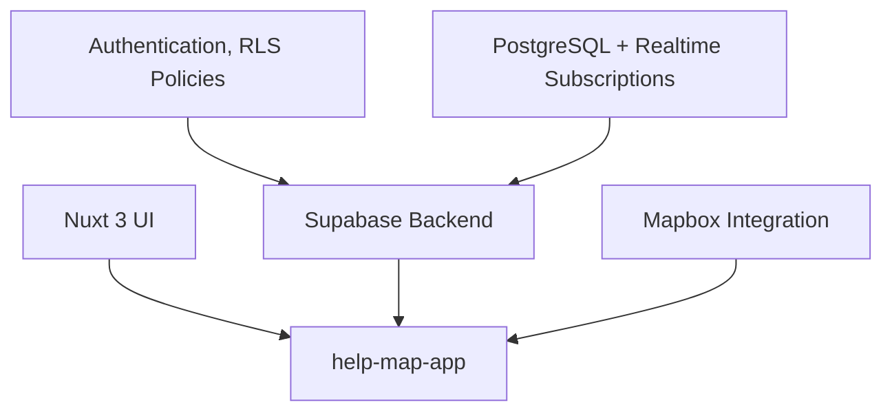

[Code for Norway](https://github.com/codefornorway) > [Projects](https://github.com/codefornorway/help-map)

# Code for Norway 🇳🇴

## Advancing Public Infrastructure through Civic Technology

**Code for Norway** is an independent, non-profit civic technology initiative committed to designing, developing, and deploying open-source digital solutions that address social, regional, and national challenges.
Our mission is to enhance public sector innovation through participatory development, engineering excellence, and community collaboration.

## Strategic Objective

The initiative is founded on the principle that well-implemented, transparent technology can significantly improve the efficiency, inclusivity, and responsiveness of public services.

Key principles of our initiative include:

* **Open Participation**: Inclusive contribution model open to developers, researchers, designers, students, and public servants.
* **Evidence-Based Development**: Solutions derived from validated community needs and stakeholder input.
* **Modular Architecture**: Emphasis on reusable components and interoperability with public infrastructure.
* **Open Standards and Licensing**: All source code is publicly accessible under permissive open-source licenses.

## System Architecture and Organizational Framework

The Code for Norway project structure is designed to scale with community needs and evolving technological capabilities. Our repositories follow a layered architecture model:

* **Presentation Layer**: Frontend interfaces built with modern web frameworks.
* **Data Layer**: Realtime databases and RESTful APIs hosted on open cloud platforms.
* **Integration Layer**: GIS, authentication, and public data pipelines.
* **Security and Compliance**: Privacy-aware implementations, aligning with GDPR and accessibility standards.

Explore our organizational repositories:
➡️ [github.com/codefornorway](https://github.com/codefornorway)

## ⭐ Flagship Project: Help Map

### 🧭 Abstract

**Help Map** is a civic technology platform designed to map and disseminate life-critical resources (e.g. food, clothing, emergency housing) across Norway. The platform leverages geospatial data, community contributions, and real-time updates to connect vulnerable individuals with essential services in their immediate vicinity.

### 📐 System Overview

**Project Title**: Help Map — Civic Resource Navigation System
**Target Demographic**: Displaced individuals, social workers, NGOs, local governments
**Primary Objective**: To improve accessibility to basic needs through accurate geolocation and open service mapping
**Development Model**: Community-contributed, publicly governed, academically inspired

### 🏗 Technical Architecture

**Frontend**

* Framework: `Nuxt 3` (Vue 3 composition API, SSR-enabled)
* Design: Mobile-first, WCAG-compliant, multilingual-ready

**Backend**

* Platform: `Supabase` (open-source Firebase alternative)
* Database: `PostgreSQL` with RLS (Row-Level Security) for multi-tenant data protection
* Realtime Engine: Supabase Channels (websocket-based pub/sub)

**Map Layer**

* Provider: `Mapbox GL JS`
* Features: Dynamic clustering, service category filtering, location-based search

### 📊 Engineering Goals

| Metric                      | Target Value                    |
| --------------------------- | ------------------------------- |
| API Response Time (P95)     | < 250ms                         |
| Map Data Load (initial)     | < 1.5s                          |
| Availability (12-month avg) | ≥ 99.9%                         |
| Mobile Accessibility Score  | ≥ 90 (Lighthouse Accessibility) |
| Contributor Onboarding Time | < 30 minutes                    |

### 🎯 Project Outcomes

* **Social Impact**: Reduces informational inequality and supports emergency response coordination
* **Technical Scalability**: Architecture supports federation and localized service expansion
* **Open Governance**: Maintained under transparent GitHub workflows, with discussion threads open to public input

> [🔗 Access the Help Map repository](https://github.com/codefornorway/help-map)

## Contribution Framework

We welcome contributors from all disciplines and sectors.

### Roles

* **Software Engineers**: Full-stack or frontend-focused development
* **UX Designers**: Accessibility and usability improvement
* **Policy Analysts & Researchers**: Needs assessments and civic alignment
* **Community Contributors**: Field data validation and outreach

### How to Participate

1. ⭐ Star the repository and follow our updates
2. 🐛 Submit issues or improvement suggestions
3. 💻 Open pull requests with new features or fixes
4. 📧 Contact us to propose new projects or pilot collaborations

## Knowledge and Research

### Thematic References

* [Civic Technology: Definitions and Frameworks](https://en.wikipedia.org/wiki/Civic_technology)
* [Digital Inclusion in the Nordic Region – SSB](https://www.ssb.no/en)
* [Open Source in European Public Administration – EU OSOR](https://joinup.ec.europa.eu/collection/open-source-observatory-osor)

### Frequently Asked Questions

* [What is civic tech?](https://codeforall.org/about/)
* [How to contribute without coding?](https://opensource.guide/how-to-contribute/)
* [Are municipalities encouraged to collaborate?](mailto:sefabulak@icloud.com)

## Administrative Details

**Last Update**: 14 July 2025

### Legal & Compliance

* [Privacy Statement](https://github.com/codefornorway/.github/blob/main/PRIVACY.md)
* [License (MIT)](https://github.com/codefornorway/help-map/blob/main/LICENSE)
* [Code of Conduct](https://github.com/codefornorway/.github/blob/main/CODE_OF_CONDUCT.md)
* [Accessibility Commitment](https://github.com/codefornorway/.github/blob/main/ACCESSIBILITY.md)

## Contact and Communication

* 📧 Email: [sefabulak@icloud.com](mailto:sefabulak@icloud.com)
* 💬 Community Threads: [GitHub Discussions](https://github.com/codefornorway/help-map/discussions)
* 🗂 Issue Tracking: Use the issue tab in each relevant repository

  <strong>🚀 Advancing digital public infrastructure — transparently, openly, together.</strong> 
  <em>Let’s build a more inclusive Norway through civic technology and engineering excellence.</em>

