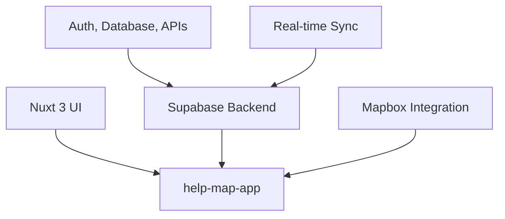

[Code for Norway](https://github.com/codefornorway) > [Projects](https://github.com/codefornorway/help-map)

# Code for Norway 🇳🇴

## Civic Technology for a Stronger, More Inclusive Norway

**Code for Norway** is a non-profit civic technology initiative focused on developing open-source digital tools that address societal challenges across the country.
The initiative brings together a diverse group of developers, designers, public servants, students, activists, and citizens to co-create digital services with real-world impact.

## Digital Innovation for the Public Good

Inspired by global civic tech movements, Code for Norway aims to improve the relationship between people and public institutions through accessible and transparent digital solutions.

The Code for Norway initiative is:

* **open to all contributors**: Any developer, designer, student, or citizen with a civic mindset is welcome to participate.
* **designed for real needs**: Projects address social and local challenges in Norwegian communities.
* **driven by community**: Solutions are developed collaboratively, in the open, and under permissive open-source licenses.

By empowering citizens with technology, we promote transparency, inclusion, and participation in public life.

## Architecture and Project Framework

Since its founding, Code for Norway has emphasized building a flexible, scalable and community-driven technical foundation for civic innovation.

Each project under the organization adheres to the following principles:

* Modular and reusable architecture
* Free and open-source software
* Inclusive and human-centered design
* Compatibility with public infrastructure when applicable

The organization currently maintains several repositories, including experimental projects, reference applications, and public infrastructure tools.
You can explore them all here:
➡️ [github.com/codefornorway](https://github.com/codefornorway)

## ⭐ Featured Project – Help Map

**Help Map** is an interactive, community-powered platform that connects people in need with essential services such as food, clothing, and emergency shelter.

The project demonstrates the potential of civic technology to reduce inequality and improve access to local support services across Norwegian cities and towns.

The Help Map platform provides:

* 🗺️ Visual, location-based service listings
* 👥 Community-driven data input and updates
* 📱 Mobile-first, inclusive user experience
* ⚡ Real-time data synchronization and open data accessibility

> [🔗 Learn more and explore the repository](https://github.com/codefornorway/help-map)

## High Level Technical Overview

### Help Map Platform Architecture

A high-level overview of the Help Map project can be found in the diagram below.

The system is designed to support modularity and interoperability with other civic tech tools that may be developed by Code for Norway in the future.

## Get Involved

### For Contributors

* **Developers**: Help implement, test, and maintain open-source software
* **Designers**: Enhance usability, accessibility, and visual clarity
* **Researchers**: Analyze needs, evaluate solutions, and support decision-making
* **Community Members**: Test applications, provide feedback, and promote outreach

### How to Participate

1. ⭐ Star our repositories and follow our work
2. 🐛 Report issues or request new features
3. 💻 Submit pull requests to improve the projects
4. 📧 Reach out to collaborate or suggest new ideas

## Related Content

### Key Themes

* [Civic Technology Overview](https://en.wikipedia.org/wiki/Civic_technology)
* [Digital Inclusion in Norway (SSB)](https://www.ssb.no/en)
* [Open Source for Government (EU OSOR)](https://joinup.ec.europa.eu/collection/open-source-observatory-osor)

### Frequently Asked

* [What is civic tech?](https://codeforall.org/about/)
* [How can I contribute without coding?](https://opensource.guide/how-to-contribute/)
* [Can municipalities participate?](mailto:sefabulak@icloud.com)

#### Last update

14 July 2025

## About Us

* [Privacy Statement](https://github.com/codefornorway/.github/blob/main/PRIVACY.md)
* [License](https://github.com/codefornorway/help-map/blob/main/LICENSE)
* [Community Guidelines](https://github.com/codefornorway/.github/blob/main/CODE_OF_CONDUCT.md)
* [Accessibility Statement](https://github.com/codefornorway/.github/blob/main/ACCESSIBILITY.md)

## [Code for Norway on GitHub](https://github.com/codefornorway)

* 📧 Email: [sefabulak@icloud.com](mailto:sefabulak@icloud.com)
* 💬 Discussions: [GitHub Discussions](https://github.com/codefornorway/help-map/discussions)
* 📌 Issues: Use individual repository issue tabs

---

  <strong>🌟 Join us in building digital tools for the public good</strong> 
  <em>Let’s shape a better Norway — one commit at a time.</em>

