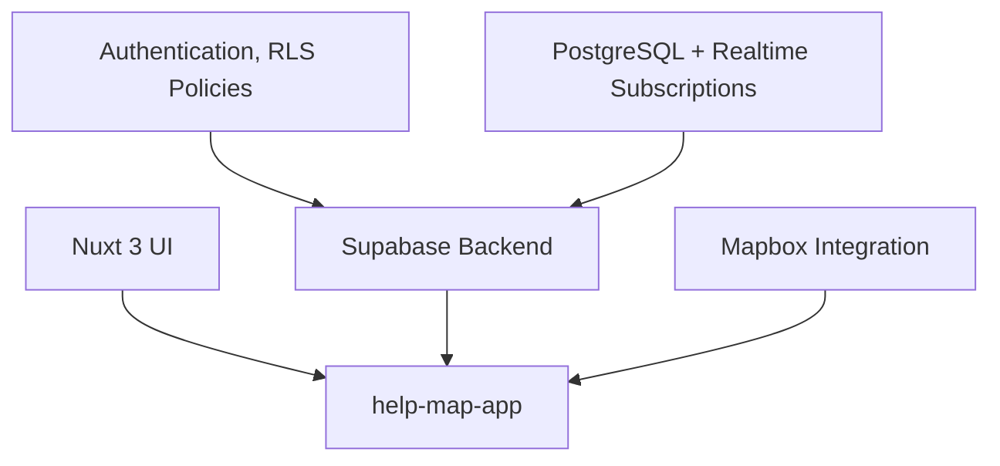

[Code for Norway](https://github.com/codefornorway) > [Projects](https://github.com/codefornorway#flagship-project-help-map)

Official Website: [codefornorway.org](https://codefornorway.org)

# Code for Norway

## Advancing Public Infrastructure through Civic Technology

**Code for Norway** is an independent, non-profit civic technology initiative dedicated to designing, developing, and deploying open-source digital solutions that address social, regional, and national challenges.

Our mission is to enhance innovation in the public sector through participatory development, engineering excellence, and structured civic collaboration.

## Strategic Objective

The initiative is founded on the premise that public infrastructure can be significantly improved through transparent, modular, and inclusive digital systems.

We adhere to the following principles:

- **Open Participation** — We foster inclusive collaboration, welcoming developers, designers, researchers, students, and public administrators.
- **Evidence-Based Development** — Our solutions are derived from validated community needs and informed stakeholder feedback.
- **Modular Architecture** — We prioritize reusable components and interoperable platforms aligned with public sector standards.
- **Open Standards and Licensing** — All codebases are accessible under permissive open-source licenses, ensuring transparency and extensibility.

## System Architecture and Organizational Framework

Our project architecture is structured to accommodate evolving civic needs, using a layered model:

- **Presentation Layer** — User-facing components built with modern frontend frameworks
- **Data Layer** — Cloud-hosted databases and RESTful or GraphQL APIs
- **Integration Layer** — GIS services, authentication mechanisms, and public data pipelines
- **Security & Compliance** — Privacy-aware implementations aligned with GDPR and accessibility directives

🔗 [View all repositories](https://github.com/codefornorway)

## Flagship Project: Help Map

### Abstract

**Help Map** is a digital civic infrastructure project that facilitates access to essential resources—such as food, shelter, clothing, and emergency services—through an open and continuously updated geospatial platform.

### System Overview

- **Title**: Help Map — Civic Resource Navigation System
- **Target Users**: Displaced individuals, municipal staff, NGOs, field workers
- **Objective**: To enhance equitable access to basic services through geolocation-based public mapping
- **Development Model**: Community-contributed, publicly governed, academically aligned

### Technical Architecture

```mermaid
graph TD;
    A[help-map-app]
    B[Nuxt 3 UI] --> A
    C[Supabase Backend] --> A
    D[Mapbox Integration] --> A
    E[Authentication, RLS Policies] --> C
    F[PostgreSQL + Realtime Subscriptions] --> C
```

**Frontend**

- Framework: `Nuxt 3` with Vue Composition API, server-side rendering enabled
- Accessibility: WCAG 2.1 compliant, responsive, multilingual support

**Backend**

- Platform: `Supabase` (open-source Firebase alternative)
- Database: `PostgreSQL` with RLS for user-level data isolation
- Realtime: Supabase Channels (websocket-based subscription model)

**Mapping Layer**

- Provider: `Mapbox GL JS`
- Features: Real-time data overlays, proximity filtering, dynamic service clustering

### Engineering Objectives

| Metric                      | Target                     |
| --------------------------- | -------------------------- |
| API Response Time (P95)     | < 250ms                    |
| Initial Map Load Time       | < 1.5s                     |
| System Availability         | ≥ 99.9% (rolling 12-month) |
| Mobile Accessibility Score  | ≥ 90 (Lighthouse score)    |
| Contributor Onboarding Time | < 30 minutes               |

> 🔗 [Access the Help Map repository](https://github.com/codefornorway/help-map)

## In Development: Work for Norway

### Overview

**Work for Norway** is a forthcoming digital infrastructure initiative aimed at enhancing civic engagement and social reintegration through skill-based volunteering and micro-tasking.

This project is currently in the planning and research phase.

**Preliminary Objectives**:

- To connect residents and newcomers with short-term public-benefit tasks in their municipality
- To foster digital and in-person community engagement through verifiable civic participation
- To pilot a framework for decentralized labor contributions to local initiatives

**Status**: Planning and stakeholder consultation
**Expected Technologies**: Decentralized ID (DID), Supabase, Nuxt, secure task validation layers

> 🧭 Repository and architectural documentation will be shared as development begins.

## Contribution Framework

We invite participation from individuals with diverse backgrounds.

### Contributor Roles

- **Software Engineers** — Specializing in open-source frontend, backend, or full-stack development
- **Design Experts** — Focused on accessibility, UX research, and inclusive interface development
- **Social Scientists & Policy Analysts** — Supporting evidence-based alignment with public need
- **Community Coordinators** — Engaged in field validation, localization, and user research

### How to Contribute

1. ⭐ Star the repositories and follow development progress
2. 📁 Review open issues and submit improvement suggestions
3. 🔀 Submit pull requests with features or documentation
4. 📩 Propose collaborative civic projects via [hey@codefornorway.org](mailto:hey@codefornorway.org)

## Knowledge and Research

### Selected References

- [Civic Technology – Wikipedia](https://en.wikipedia.org/wiki/Civic_technology)
- [Open Source in European Public Administration – OSOR](https://joinup.ec.europa.eu/collection/open-source-observatory-osor)
- [Digital Inclusion Reports – Statistics Norway (SSB)](https://www.ssb.no/en)

### Frequently Asked Questions

- [What is civic tech?](https://codeforall.org/about/)
- [How to contribute without programming experience?](https://opensource.guide/how-to-contribute/)
- [Are local governments invited to participate?](mailto:hey@codefornorway.org)

## Legal and Administrative Details

**Last Updated**: 02 August 2025

- [Privacy Statement](https://github.com/codefornorway/.github/blob/main/PRIVACY.md)
- [MIT License](https://github.com/codefornorway/help-map/blob/main/LICENSE)
- [Code of Conduct](https://github.com/codefornorway/.github/blob/main/CODE_OF_CONDUCT.md)
- [Accessibility Commitment](https://github.com/codefornorway/.github/blob/main/ACCESSIBILITY.md)

---

## Contact and Communication

- 📧 Email: [hey@codefornorway.org](mailto:hey@codefornorway.org)
- 💬 Discussions: [GitHub Discussions](https://github.com/orgs/codefornorway/discussions)
- 🗂 Issues: Use the _Issues_ section in each repository for reporting and tracking

  <strong>🚀 Advancing digital public infrastructure — transparently, rigorously, and collectively.</strong> 
  <em>Join us in reimagining civic systems through open collaboration and technical stewardship.</em>

